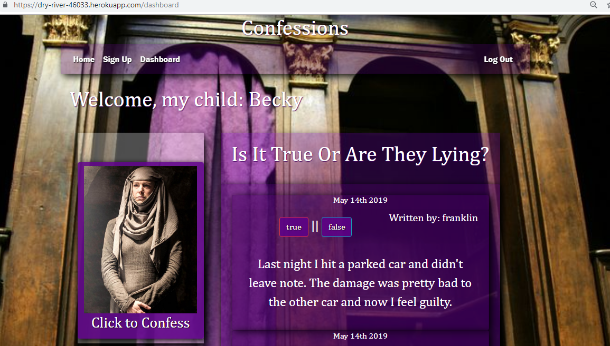

 # Confessions #

Project 2 Confessions is a full stack application created by 
* Nitza Rondon-Rosario 
* Facundo L. Rodriguez 
* Frank Calovini 
* Chris Paul

 # Project 2 Requirements #

* Using Node and Express Web Server;
* Backed by a Sequelized MySQL Database;
* It has GET and POST routes for retrieving and adding new data;
* It is deployed using Heroku (with Data);
* Utilize at least one new technology: Express-session for user authentication, sign-up login logout, also CSS Animations for layout and display ;
* A polished frontend / UI;
* Has a folder structure that meets MVC Paradigm;
* Meets good quality coding standards (indentation, scoping, naming).

 ## Project Synopsis ##
Confessions is an application which signs up users so they can write stories (confessions) which can be voted on by other users whether the story is true or false. The application creates two tables in the databse one for user and one for confessions. The output is not only the confession but the user that created it. Using sequelize to combine two tables into one.

 

 [demo](https://dry-river-46033.herokuapp.com/dashboard)